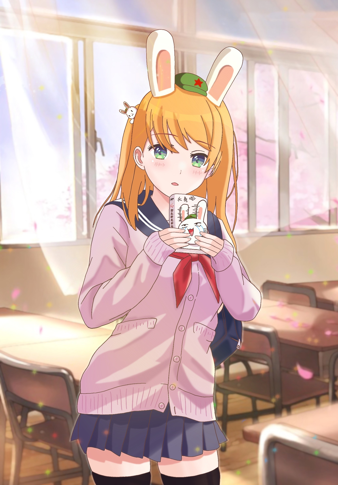
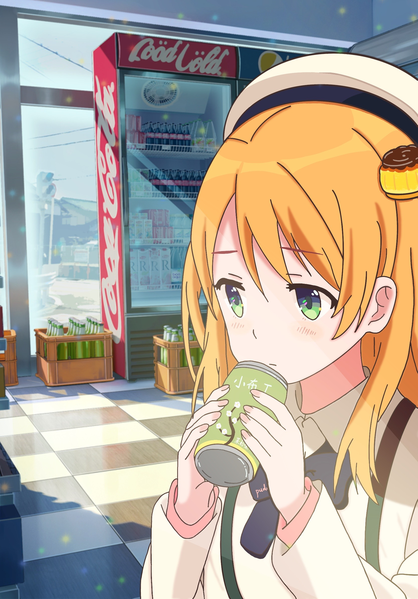
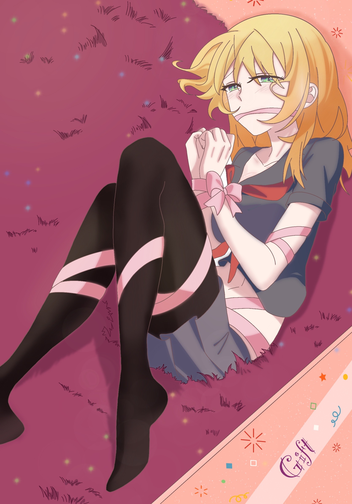
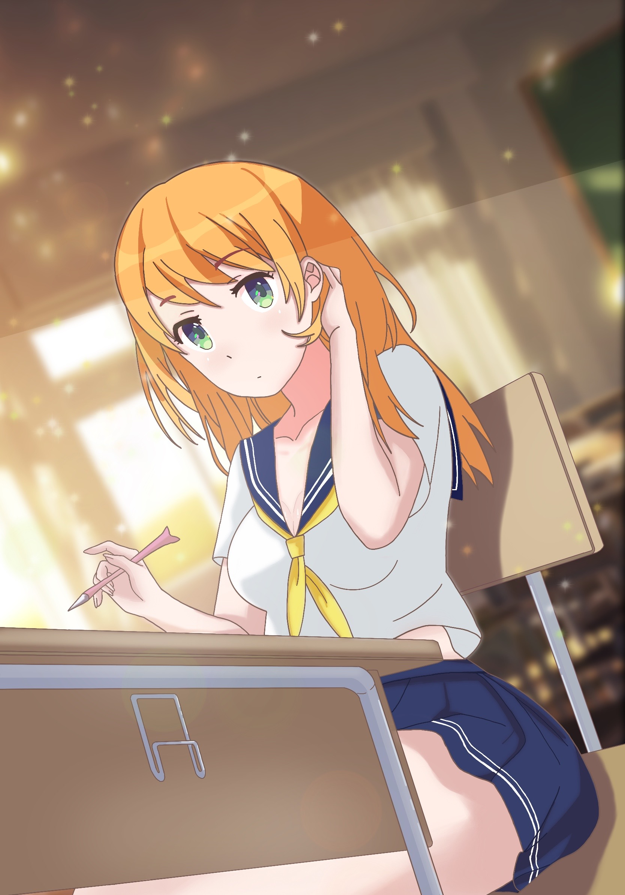

 
 <h2 align="center">布丁的插画集</h2>

  
  
  
  

### 🍮 布丁是谁？

嗨，大家好，我是原创人物 “布丁” 的作者。我业余时间喜欢用 iPad 画一些二次元的插画，布丁这个人物就是我慢慢摸索中确定并画出来的（二次元人物实在是太多了，想要画一个有一定识别度的，而且还不能跟已有的人物重样，的确有一定难度...）。

我呢，最终给他取名 “布丁”（英文名 _Pudding_），所以人物的主体颜色也都是来源于布丁 🍮。人物性格嘛，设置乖巧一点、可爱一点、温柔一点吧。Emm，至于人物的生日、血型等等，以后再说吧~

之后呢，我有时间就会画一些新的插画练练手，然后分享到这里。

### 🎨 插画

| 插画 |   作品名   | Pixiv 地址 | Behance 地址 |
| :----------------------------------------------------------: | :----------: | :----------------------------------------------------------: | :----------------------------------------------------------: |
|  | 《那兔 Cosplay》 | [查看](https://www.pixiv.net/artworks/97722612) | [查看](https://www.behance.net/gallery/141910191/Rabbit-Cosplay) |
|  | 《喝饮料》 | [查看](https://www.pixiv.net/artworks/97722555) | [查看](https://www.behance.net/gallery/141909257/Drink-Pudding) |
|  | 《礼物盒》 | [查看](https://www.pixiv.net/artworks/95340507) | [查看](https://www.behance.net/gallery/134497941/Gift-Box) |
|  | 《课后教室》 | [查看](https://www.pixiv.net/artworks/95340455) | [查看](https://www.behance.net/gallery/134497441/Classroom) |

### © 版权

[License](https://github.com/pudding0503/pudding-illustration/blob/master/LICENSE)

个人日常随意使用，转载需保留作者信息，不得盗用、冒用、窃取等。
